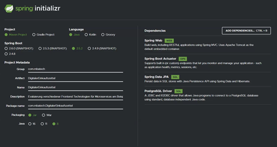

# VS-Studienprojekt-MA-MB
## Themen Beschreibung
Evaluierung verschiedener Frontend Technologien für Microservices am Beispiel einer simplen Spring Boot Anwendung

# 1. Starten des Projekts

Mit der docker-compose.yml Datei lässt sich das Projekt ganz einfach mit einem einzigen Befehl starten:
```
docker-compose up -d
```
Die Adressen:

REST API: http://localhost:8080

Angular Frontend: http://localhost:4200

React Frontend: http://localhost:3000

Vue Frontend: http://localhost:2000

# 2. Projekterklärung

## 2.1 Frameworks
In dieser Studienarbeit geht es um die Evaluierung verschiedener Frontend Technologien für Microservices am Beispiel einer simplen Spring Boot Anwendung, hierfür haben wir uns für die drei am meisten verbreiteten JavaScript Frontend Frameworks entschieden. Angular, React und Vue.js. Als Backend Framework wird dabei Spring Boot verwenden. Diese Frameworks betrachten wir nun im Detail.

### 2.1.1 Backend

#### 2.1.1.1 Spring-Boot
Spring Boot ist eine „Konvention vor Konfiguration“-Lösung für das Java-Framework Spring, die 2012 veröffentlicht wurde und die Komplexität der Konfiguration neuer Spring Projekte reduziert. Zu diesem Zweck legt Spring Boot eine Grundkonfiguration inklusive Richtlinien für die Nutzung des Frameworks sowie aller relevanten Drittanbieter-Bibliotheken fest und gibt damit den Weg vor, um den Einstieg in neue Projekte so mühelos wie möglich zu gestalten. Auf diese Weise lässt sich die Kreation eigenständiger, produktionsreifer Applikationen auf Basis von Spring erheblich vereinfachen, weshalb der Großteil neuer Spring-Anwendungen konsequenterweise auch auf Spring Boot aufsetzt.

Die Merkmale von Spring Boot lassen sich wie folgt zusammenfassen:

direktes Einbetten von Webserver-/Container-Anwendungen wie Apache Tomcat oder Jetty möglich, wodurch kein Einsatz von WAR-Dateien (Web Application Archive) erforderlich ist vereinfachte Maven-Konfiguration dank „Starter“-POMs (Project Ob-ject Models) automatische Spring-Konfiguration, wann immer dies möglich ist. Bereitstellung nichtfunktionaler Features wie Metriken oder ausgelagerter Konfigurationen

### 2.1.1.2	Backend Beschreibung



Die Spring-Boot Anwendung wurde mit den im Bild zu sehenden Einstellungen erstellt. Als Dependencies wurden hierbei Spring Web, Spring Boot Actuator, Spring Data JPA sowie PostgreSQL Driver verwendet. 

In ShoppingListEntity.java wird die ShoppingListEntity definiert, welche auf der Datenbank persistent gespeichert wird. Mit der @Entity Annotation kennzeichnet man, dass die Klasse von JPA persistiert werden soll. Die @Id Annotation kennzeichnet den Primärschlüssel. Mit der @GeneratedValue(strategy = GenerationType.SEQUENCE) Annotation sagt man außerdem, dass die zugehörigen Werte aufsteigend generiert werden sollen. Eine solche Klasse muss außerdem einen Default Konstruktor enthalten. Des weiteren sind noch ein weiterer Konstruktor sowie benötigte getter und setter Methoden definiert. 

Mit Hilfe des Codes in der ShoppingListRepository.java Datei ist es dank Spring Data JPA nicht mehr notwendig eine Implementierung des Repository Interface zu schreiben, dies übernimmt Spring Data JPA indem eine Implementierung on the fly erstellt wird. JPARepository enthält dabei die vollständige API von CrudRepositry und PagingAndSortingRepository.

In JPAController.java wird das REST Interface definiert. Mithilfe der @CrossOrigin Annotation werden die API aufrufe von unseren Frontends zugelassen. Die @RestController Annotation ist eine spezialisierte Version der @Controller und der @ResponseBody Annotation. Dabei wird jedes Rückgabeobjekt einer Methode die einen Request behandelt in eine HttpResponse serialisiert. Mit der @GetMapping, @PostMapping, @PutMapping und @DeleteMapping Annotationen wird ein HTTP GET, POST, PUT oder DELETE Request an eine Handler Methode gebunden. In dem Handler sind dann die Aktionen definiert die bei einem Request durchgeführt werden sollen. Außerdem wird eine entsprechende Antwort zurückgegeben.

In der applications.properties Datei sind die benötigten Konfigurationen um auf die Datenbank zuzugreifen hinterlegt. 

### 2.1.2 Frontend

#### 2.1.2.1 Angular
Das von Google gepflegte Framwork Angular ist eine der ältesten Webentwicklungs Frameworks. Die erste Version stammt aus dem Jahr 2010, mittlerweile steht wurde am 13. Mai 2021 die 12. Version released (Stand: 19. Juli 2021). Entsprechend ausgereift ist das Framework. Von Haus aus gibt es kaum eine Problemstellung, die mit Angular nicht gelöst und als Web-Applikation umgesetzt werden kann.
Das Coding erfolgt in der Programmiersprache TypeScript. Diese kann man sich vorstellen als JavaScript, erweitert um objektorientierte Programmierelemente. Insbesondere statische Typisierung (also Typzuweisung zu Variablen) kann gerade bei größeren Projekten helfen, Fehler zu vermeiden gewisse Strukturen einzuhalten.

Grundlegenden Konzepte die wichtig bei Angular sind:

**Components** sind logische Kapselungen gewünschter Funktionalitäten, die sich an gewünschten Stellen wiederverwenden lassen.

**Services** sind eine einfache Möglichkeit Funktionen für alle Komponenten zugänglich zu machen. (Globalisierte Funktion die man überall verwenden kann)

**Directives** erleichtern das Coden von JavaScript, indem Grundfunktionen wie if-Abzweigungen oder for-Loops mit wenigen Schritten ohne viel Code eingefügt werden können.

**Dependency Injection** stellt einen sog. DI-Container zur Verfügung. Häufig verwendete Services (z. B. Datenbankabfragen) lassen sich hierüber kapseln und bei Bedarf in gewünschten Komponenten aufrufen.


#### 2.1.2.1.1 Angular Installation
Um Angular zu installieren, haben wir ein Terminalfenster geöffnet und den folgenden Befehl ausgeführt:
```
npm install -g @angular/cli
```
Als nächstes haben wir die Angular Application installiert mit:
```
ng new DigitalerEinkaufszettelAngular
```
Nun fügen wir unsere Komponenten hinzu aus der sich am Ende die Webseite zusammensetzen wird:
```
cd DigitalerEinkaufszettelAngular
ng g c page-list
ng g c _template/template-tobuy
ng g c _template/template-tobuy-form
ng g c _template/template-header  
```
Nun fügen wir einen Service hinzu:
```
ng g s _service/data
```
Nun fügen wir noch custom Interfaces hinzu:
```
ng g i _interface/tobuy
ng g i _interface/eventping
```
Nun testen wir wieder ob alles funktioniert hat:
```
ng serve --open
```

#### 2.1.2.1.2 Angular Vorteile
* Modularität
* Speed & Performance
* Komplexe, webbasierte Anwendungen
* Frontend Framework

#### 2.1.2.1.3 Angular Nachteil
* Nicht für kleine Projekte geeignet
* Benötigt externe Backend Logik
* Ersetzt keine Webseite im "üblichen" Sinne

#### 2.1.2.1.4 Die API Anbindung:
Für die Anbindung des Angular Frontends an die REST API wurde in der Datei data.service.ts mit dem Observable und einem HTTP Client in den Methoden getToBuy, postToBuy und deleteToBuy die GET, POST oder DELETE Request an die API geschickt. Die Datei data.service.ts am Anfang hinzufügt und dient nur zur Anbindung der API.
Anbei befindet sich der abgespeckte Code nur für den GET Request:
```
@Injectable({
  providedIn: 'root'
})
export class DataService {

  private serverUrl = 'http://localhost:8080';

  constructor(
    private _http: HttpClient
  ) { }

  public getToBuy(): Observable<Tobuy[]>
  {
    const httpOptions = {
      headers: new HttpHeaders({
          'Content-Type': 'application/json'
      })
  };
    return this._http.get<Tobuy[]>(`${this.serverUrl}/getShoppingList`);
  }

}
```
In der page-list.component.ts sieht man nun den Aufruf dieser getToBuy Funktion und die Zuweisen in das Array:
```
public loadData():void {
    this.$toBuys = [];
    this.$toBuysDone = [];
    this._dataService.getToBuy().subscribe((data: Tobuy[]) =>{
      this.$toBuys = data;
    }, error =>{
      console.log(`%cERROR: ${error.message}`, `color: read; font-size: 12px;`);
    });

  }
``` 
In der page-list.component.html sieht man dann wie durch das Array iteriert wird:
```
 <app-template-tobuy (ping)= "update($event)" [toBuy$]= "toBuy" *ngFor="let toBuy of $toBuys"></app-template-tobuy>   
``` 
Die app-template-tobuy wird dann so oft wie es Artikel gibt Aufgrund der die template-tobuy.componenent.html erstellt.
Das heißt es wird pro Artikel eine komplett neue und freistehende template-tobuy.componenent.html mit den Daten gefüllt und in die page-list.component.html geschrieben.

#### 2.1.2.1.5 Die verschiedene Components:
In der Angular App DigitalerEinkaufszettelAngular gibt es verschieden Components, jeweils pro Component gibt es eine HTML zum anzeigen, eine Typescript für die Implementierung und eine Typescript Datei zum Testen.
Welche Components und wie man eine Component erstellt wird siehe oben.
##### Beschreibung der Components:
1. page-list -> Komponente für die eigentliche Oberfläche
2. template-tobuy -> Kompenente für die Artikel
3. template-tobuy-form -> Komponente für die Anzeige der Artikel
4. ng template-header -> Komponente für den Header 
```
<header>
    <h1>Fügen<br><span>Sie Ihre</span><br>Artikel hinzu</h1>
</header>
```
Alle Komponeneten werden in page-list geladen und page-list wird in die APP Komponente geschrieben und von dort an angezeigt.

#### 2.1.2.1.6 Sonstiges:
Ebenfalls wurden 2 Interfaces erstellt eins für die Representation der Daten die in der Datenbank verwendet werden (tobuy.ts).
Das andere Interface ist für die ping Funktionen wenn ein Event getriggert wird. (Eventping.ts).

**Fazit:**
es gibt kaum eine Frontend-Herausforderung, die mit Angular nicht gelöst werden kann. Gerade Einsteiger der Webentwicklung sollten jedoch Zeit und Durchhaltevermögen für den Einstieg mitbringen, dieser wird einem nicht immer leicht gemacht. Dementsprechend findet Angular gerade in großen und Enterprise-Applikationen Anwendung. Auch die Betreuung durch Teams mit einer Vielzahl an Mitwirkenden lässt sich effizient bewerkstelligen.

#### 2.1.2.2 React
**React** ist ein Framework entwickelt von Facebook, veröffentlicht im Jahr 2013 und geht vom Grundansatz einen anderen Weg als Angular. React ist von Haus aus schlank, klein und elementar gehalten. Es wird zunächst nur die Grundfunktionalität angeboten, z.B. Components und Properties (zum Handling von Daten). 

React ist eigentlich kein Framework, sondern eine Library handelt. Bei React verzichtet man bewusst auf Vorgabe eines festen Workflows, um Aufgaben zu lösen und Applikationen zu erstellen. Es genügt daher die Festlegung von React als einer flexibel einbindbaren Library.

React lässt sich auf zwei Arten nutzen. Man kann ein vorhandenes HTML-Projekt mit React anreichern oder man startet ein komplett neues React-Projekt, bevorzugt über die Kommandozeile des Systems.
Die Entwickler haben zum Coden die Sprache JSX erfunden. Die Idee ist vergleichbar mit einer dynamischen Erweiterung des klassischen HTML und es lässt sich schnell intuitiv damit arbeiten.

Geht man über die elementare Funktionalität von React hinaus, merkt man schnell einen entscheidenden Unterschied zu Angular. Bei React ist man weit mehr gefordert, auf Erweiterungen zu setzen, die von der Community gepflegt werden. Das führt auch dazu, dass es oft nicht den einen Weg zum Ziel gibt. Man ist herausgefordert, seinen eigenen Weg und seine bevorzugten Tools zu finden. 

#### 2.1.2.2.1 React Installation:

```
npx create-react-app digitaler-einkaufszettel-react
```
Im Projektordner (cd digitaler-einkaufszettel-react):

Installieren von Bootstrap:
```
npm install bootstrap
```
Installieren von Axios:
```
npm install axios
```

#### 2.1.2.2.2 Die API Anbindung:

Für die Anbindung des React Frontends an die REST API wurde in der Datei ShoppingListService.js die Klasse ShoppingListService erstellt. Diese enthält die jeweiligen Methoden für einen GET, POST oder DELETE Request an die API. Hierfür wurde der HTTP-Client Axios installert. 
Die Daten aus der Antwort werden dann, wie im folgenden beschrieben im ShoppingListComponent in den State eingefügt bzw. entfernt und so auf der Seite angezeigt.
```
class ShoppingListService{
  getShoppingList(){
    return axios.get(GET_SHOPPINGLIST_REST_API_URL);
  };

  deleteShoppingListEntry = (articleId) => {
    return axios.delete(DELETE_SHOPPINGLISTENTRY_REST_API_URL + articleId);
  };

  postShoppingListEntry = (article) => {
    return axios.post(POST_SHOPPINGLISTENTRY_REST_API_URL + article);
  }
}
```

#### 2.1.2.2.3 Erstellung des React Component:

Für die Anwendung wurde eine eigene Komponente (ShoppingListComponent) geschrieben. Im Konstruktor der Komponente wird im Status dabei eine Variable shoppingList erstellt, welcher ein leeres Array zugewiesen wird. Außerdem wird die Variable newShoppingListEntry erstellt, welcher ein leerer String zugewiesen wird:
```
this.state = {
            shoppingList:[],
            newShoppingListEntry: ""
};
```
Wurde die Komponente erfolgreich in das DOM gerendert so wird die componentDidMout() Methode aufgerufen. Hier wird die Methode getShoppingList() des ShoppingListService aufgerufen welche den GET Request an die API sendet. Die Daten aus der Antwort werden dann der Variable shoppingList des Status der Komponente zugewiesen:
```
componentDidMount(){
  ShoppingListService.getShoppingList().then((response) => {
    this.setState({ shoppingList: response.data})
  });
}
```
Mithilfe der map() Methode lässt sich nun für jedes der Elemente des shoppingList Array im Status ein eigener Tabelleneintrag in der Rückgabe der render() Methode erstellen. Hierbei wird jeder neuen Tabellenzeile ein eigener Schlüssel (Key), in unserem Fall die articleId, zugewiesen. Dieser Schlüssel hilft React zu erkennen welche Elemente hinzugefügt, geändert oder gelöscht werden. In jeder Zeile wird dann der entsprechende Artikel sowie ein "gekauft" Button hinzugefügt:
```
<tbody>
   {
      this.state.shoppingList.map(
         shoppingList => 
         <tr key = {shoppingList.articleId}>
            <td> {shoppingList.article}</td> 
            <td><button className="btn btn-secondary" onClick={() => this.deleteArticle(shoppingList.articleId)}>gekauft</button></td>     
         </tr>
      )
   }
</tbody>
```
Wie zu sehen ist wird beim betätigen des Buttons die deleteArticle() Methode aufgerufen welcher die entsprechende articleId des zu löschenden Eintrags übergeben wird. In dieser Methode wiederum wird dann die entsprechende Methode des ShoppingList Service aufgerufen welche den DELETE Request an die API sendet. Folgt eine korrekte Atwort der API so wird der entsprechende Eintrag aus dem shoppingList Array des Status gelöscht und somit nicht mehr auf der Seite angezeigt:
```
deleteArticle(articleId){
   ShoppingListService.deleteShoppingListEntry(articleId).then((response) => {
      if(response.data != null){
         this.setState({
            shoppingList: this.state.shoppingList.filter(shoppingListEntry => shoppingListEntry.articleId !== articleId)
         });
      } 
   });
}

```
Um einen neuen Artikel der Einkaufsliste hinzufügen zu können wurde ein Formular erstellt.
```
<form onSubmit={this.handleSubmit}>
   <div className="input-group mb-3">
      <input type="text" className="form-control" placeholder="Einkaufszettel Eintrag" value={this.state.newShoppingListEntry} onChange={this.handleInputChange}/>
      <div className="input-group-append">
         <button type="submit" className="btn btn-secondary">Hinzufügen</button>
      </div>
   </div>
</form>
```
Dieses Enthält ein Eingabefeld sowie den "Hinzufügen" Button als submit Button. Ändert sich der Inhalt des Input Feldes, so wird die handleInputChange() Methode aufgerufen, in der der geänderte Wert in die Variable newShoppingListEntry des Status geschrieben wird. Wird das Formular mit Betätigung des Buttons abgesendet, so wird die Funktion handleSubmit aufgerufen. Hier wird wiederum die Methode postShoppingListEntry der ShoppingListService Klasse aufgerufen. Dieser wird der aktuelle Wert aus der newShoppingListEntry Variable übergeben und diese schickt wiederum den POST Request an die API. Anschließend wird der neue Eintrag noch in das shoppingList Array hinzugefügt sowie der newShoppingListEntry Variable ein leerer String zugewiesen.
```
handleSubmit(event){
   ShoppingListService.postShoppingListEntry(this.state.newShoppingListEntry).then((response) => {
      this.setState({shoppingList: this.state.shoppingList.concat(response.data)});
      this.setState({newShoppingListEntry: ""});
   });
   event.preventDefault();
}
```

**Zwischenfazit Angular vs. React:** an Funktionsumfang nehmen sich beide Frameworks kaum etwas. Beide werden von Großkonzernen betreut und behaupten sich seit vielen Jahren erfolgreich am Markt. Auch die Communities sind entsprechend etabliert, so dass Hilfe nie weit entfernt ist. Wichtigster Unterschied ist der monolithische Ansatz von Angular (fast alles aus einer Hand und ein Weg zum Ziel) gegenüber dem Community-zentrierten Weg von React. Eine Auswahl zwischen beiden ist eine Frage des persönlichen Geschmacks und der eigenen Herangehensweise an Coding-Aufgaben.

#### 2.1.2.3 Vue.js
Ähnlich zu Angular handelt es sich hier um eine monolithische Lösung, die dem Entwickler alle nötigen Tools für eine umfassende Applikation anbietet. Auf Community-Tools kann zurückgegriffen werden, das ist aber nicht immer nötig (im Gegensatz zu React).

Ähnlich React lässt sich Vue.js direkt in eine vorhandene HTML-Seite oder über die Kommandozeile einbinden. Im ersten Ansatz wird die Vue.js-Bibliothek über ein script-Tag eingebunden und richtet das Objekt Vue als globale Variable im Projekt ein. Ab einer mittleren Projektgröße ist es jedoch der üblichere und ratsame Weg, Vue.js über NPM oder die CLI zu starten.

#### 2.1.2.3.1 Vue.js Installation
```
npm install -g @vue/cli
```
```
vue create digitalereinkaufszettelvue
```
```
cd digitalereinkaufszettelvue
npm run serve
```
Installation für Style: (nicht notwendig kann auch mit css gemacht werden)
```
npm install sass-loader node-sass --save
```
#### 2.1.2.3.2 Die API Anbindung:
Die Anbindung des Vue Frontends an die REST API wurde in der Datei ToBuyList.vue erstellt. Diese enthält die jeweiligen Methoden für einen GET, POST oder DELETE Request an die API. Hierfür wurde der HTTP-Client Axios installert. 
Die Daten aus der Datenbank werden in den Async Methoden Created(),addToBuy(),removeToBuy(index,tobuy), geladen oder entfernt auf der Seite angezeigt.

Als erstes wurde der HTTP- CLient Axios importiert und festgelegt was an die App.vie zurück gegeben wird.
```
import axios from 'axios';

const apiURL = "http://localhost:8080"
export default {
  name: 'tobuy-list',
 data() {
     return{
    newToBuy: '',
    idForToBuy: 3,
    filter: 'all',
    tobuys: []
  }
```
Hier sehen wir nun wie die Daten per GET Methode aus der API in das Frontend geladen werden:
```
async created(){
   try{
     const res = await axios.get (apiURL + `/getShoppingList`);
     this.tobuys = res.data;
   }catch(e)
   {
     console.log(e);
   }
```
Das Array tobuys wird mit den Daten aus dem GET request gefüllt und über dieses Array wird im HTML Part der ToBuyList.vue iteriert und den Daten werden angezeigt.
Ebenfalls wurden 2 Methoden erstellt addToBuy() und removeToBuy(index,tobuy) um einmal aus dem Textfeld nach Eingabe und drücken der Enter-taste die Daten auf die Datenbank zu schreiben und auf der Webseite anzuzeigen und einmal um Artikel aus der Liste einzeln zu löschen.
Wenn Artikel gekauft wurden kann man diese per Click auf die jeweilige Check-box abhaken, diese werden dann durchgestrichen.
Wenn mindestens ein Artikel abgehakt ist kann man diesen aus der Liste und der Datenbank mit einem Klick auf den "Clear gekaufte" Button löschen. 
```
async clearCompleted() {
      
      for (let index = 0; index < this.tobuys.length; index++) {
        if (this.tobuys[index].completed)
        {
          const res = await axios.delete(apiURL + `/deleteShoppingListEntry/${this.tobuys[index].articleId}`);
          console.log(res)
        }
      }
      this.tobuys = this.tobuys.filter(tobuy => !tobuy.completed)
    }
  },
```
In der Funktion clearCompleted() wird durch alle gekauften Artikel durch iteriert und dann aus der Datenbank gelöscht, am Schluss dieser Funktion werden alle tobuys mit dem Filter auf alle noch nicht gekauften Artikel gesetzt.
Es wurde dann noch ein Filter eingebaut um Alle Artikel, Gekaufte und nicht gelöschte und Artikel zum Kaufen gefiltert anzuzeigen.
(Siehe Code und Funktion tobuysFiltered())
Ebenfalls wird die Anzahl der noch zu kaufenden Artikel angezeigt. (Siehe remaining().
```
computed:{
     remaining() {
      return this.tobuys.filter(tobuy => !tobuy.completed).length
    },
     anyRemaining() {
      return this.remaining != 0
    },
     tobuysFiltered() {
      if (this.filter == 'all') {
        return this.tobuys
      }
      else if (this.filter == 'Kaufen') {
        return this.tobuys.filter(tobuy => !tobuy.completed)
      }
      else if (this.filter == 'Gekauft') {
        return this.tobuys.filter(tobuy => tobuy.completed)
      }
      return this.tobuys
    },
     showClearCompletedButton() {
      return this.tobuys.filter(tobuy => tobuy.completed).length > 0
    },

  }
```
**Bedeutung computed:** 
Manchmal benötigen wir einen Zustand, der von einem anderen Zustand abhängt - in Vue wird dies mit berechneten Eigenschaften der Komponente gehandhabt. Um einen berechneten Wert direkt zu erzeugen, können wir die Methode computed verwenden: Sie nimmt eine Getter-Funktion und gibt ein unveränderliches reaktives Ref-Objekt für den vom Getter zurückgegebenen Wert zurück.

**Zusammenfassend** können wir sagen, dass mit Vue.js eine Alternative zu großen Konkurrenten entstanden ist, die sich gerade für kleine und mittlere Projekte lohnt. So mancher Overhead, die in Angular manchmal zu tragen sind, lassen sich mit Vue.js elegant und einfach vermeiden. Für sehr Enterprise-Anwendungen kann das Framework an seine Grenzen stoßen, insbesondere wenn Community-Erweiterungen und Frage-Antwort-Tabellen sind. Hier sind die Älteren im Vorteil.

## 2.2	Docker

### 2.2.1	Docker Beschreibung

Docker ist eine Open Source Software welche ursprünglich auf die Containervirtualisierung, zur Isolierung von Anwendungen mit Linux ausgerichtet war. Mittels bestimmten Tools ist sie auch für Windows und MacOS anwendbar. 2 In diesem Bericht wird jedoch ausschließlich über die Verwendung von Docker in einer Linux-Umgebung berichtet.

Ein Docker Container ist eine aktive Instanz eines Docker Images. Ein Image ist ein schreibgeschütztes, ausführbares Template, welches alle notwendigen Abhängigkeiten beinhaltet, um die gewünschte Applikation zu bauen und/oder auszuführen. Der Code, Bibliotheken, Konfigurationsdateien aber auch Software-Plattformen, wie .Net Core sind einige der Beispiele, die ein Image beinhalten kann. Diese Abhängigkeiten werden als Schritte, auch Layers genannt, in ein Dockerfile geschrieben, um sie dem Image hinzuzufügen.

### 2.2.2	Docker im Projekt

Docker wurde dafür verwendet um Dockerimages aus den Frontends und dem Backend mit Hilfe von Dockerfiles bzw. Jib zu erstellen.

**Beispiel Dockerfile Angular:**
```
FROM node:alpine as build-step
WORKDIR /DigitalerEinkaufszettelAngular
COPY package.json .
RUN npm install
COPY . .
RUN npm run build --prod

FROM nginx:alpine
COPY --from=build-step /DigitalerEinkaufszettelAngular/dist/DigitalerEinkaufszettelAngular /usr/share/nginx/html
```
Der erste Teil kompiliert und buildet die Angular Code Basis, dazu wird das node Image als Basisimage benutzt und das Arbeitsverzeichnis festgelegt. Dann wird die package.json Datei kopiert und die Abhängigkeiten installiert. Anschließend wird der Sourcecode kopiert und die Applikation gebuildet. Im zweiten Teil wird die Applikation per nginx-Server bereitgestellt, dazu wird das nginx-Image als Basis-Image benutzt und der Standard nginx Inhalt mit dem vorherigen Build ersetzt. Die Dockerfiles der anderen Frontends wurden äquivalent dazu erstellt.
## 2.3	Fazit
